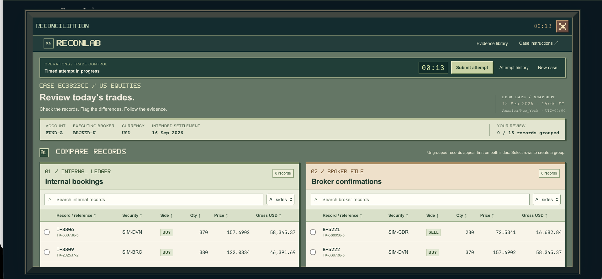
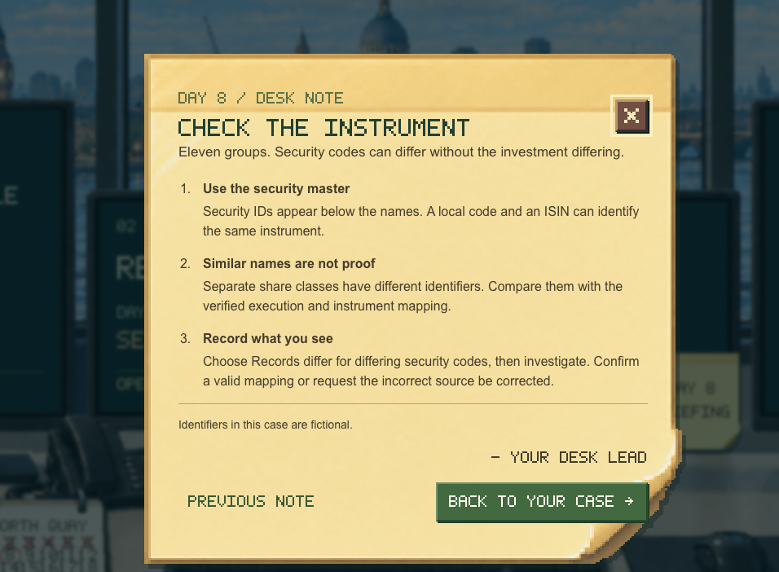
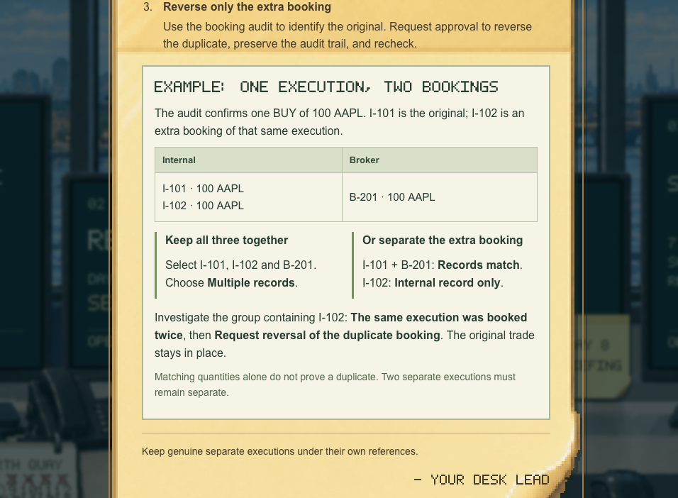

# OpsDesk — Reconciliation Simulator

An interactive, 30-day training game for practising investment operations and reconciliation.

Built by **Lucas Kent**, a First-Class Economics graduate from the University of Exeter, to explore the judgement behind middle-office work: identifying discrepancies, interpreting evidence and deciding what should happen next.

**[Open OpsDesk](https://opsdesksim.com)** — the custom domain is being connected.

## What you do

You work at an operations desk overlooking London. Each day brings a briefing and a new set of records to reconcile.

1. Compare internal records with broker, custodian or other external records.
2. Group related records and identify matches, differences, missing entries and multiple-record cases.
3. Investigate exceptions using execution evidence, booking histories and other source information.
4. Choose a diagnosis and next action. Later cases include a simulated correction request and a check of refreshed records.
5. Review the scored feedback, correct mistakes and reach 100% to unlock the next day.

## What the campaign covers

| Days | Focus |
|---|---|
| 1–6 | Guided tutorial, independent matching, quantity and price breaks, missing and duplicate bookings |
| 7–16 | Accounts, security identifiers, references, timing, partial fills, weighted prices, allocations, amendments, conflicting evidence and fees |
| 17–21 | Settlement dates, status, instructions, priorities and partial settlement |
| 22–26 | Cash, positions, stock splits, dividends and incomplete source files |
| 27–30 | Linked discrepancies, correction requests, refreshed records and a final mixed-book assessment |

Completed days can be replayed with newly generated cases; Day 1 repeats the guided tutorial. Results retain the latest score, first result and retry count. Progress is saved in the browser.

## Screenshots

These are actual development screenshots. Some show the earlier ReconLab name and interface; the current project is called OpsDesk.

### Compare source records

### Read the day's briefing

### Learn how to handle exceptions

## How it was built

- **HTML, CSS and JavaScript**, with no application framework or backend required.
- Seeded case generation keeps an unfinished exercise consistent while allowing fresh replay cases.
- Rule-based scoring assesses record grouping, comparison, diagnosis, action and selected follow-up checks.
- Node.js tests exercise scoring, progression, persistence and correction flows.
- Pixel-art office and after-hours settings place the working screens inside an interactive desk scene.

The aim is a useful practice environment for graduates exploring operations roles. It is a portfolio and learning project; it has not been independently validated as an employer assessment. Case data and reviewer responses are simulated, and scores are stored locally.
